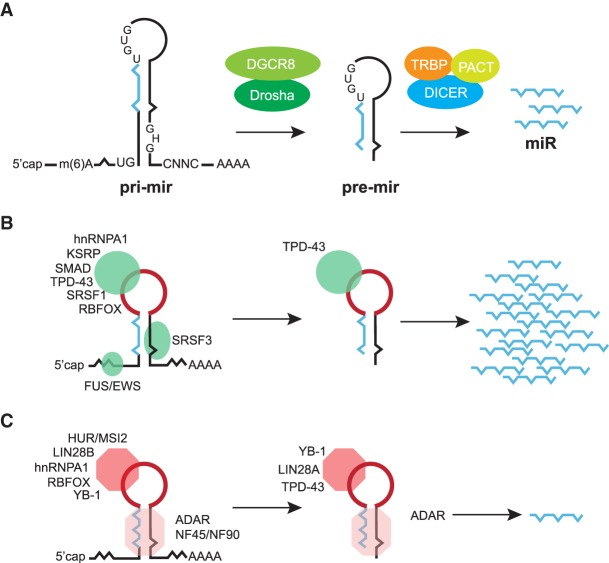

[TOC levels=1-3]: #

# Table of Contents
- [Table of Contents](#table-of-contents)
- [Name](#name)
- [Abstract](#abstract)
- [Introduction -- miRNA Biogenesis Pathway](#introduction----mirna-biogenesis-pathway)
  - [Nuclear step of miRNA processing](#nuclear-step-of-mirna-processing)
  - [Cytoplasmic step of miRNA processing](#cytoplasmic-step-of-mirna-processing)
  - [Noncanonical functions of the Microprocessor](#noncanonical-functions-of-the-microprocessor)
- [Role of RBPs in the regulation of miRNA biogenesis](#role-of-rbps-in-the-regulation-of-mirna-biogenesis)
  - [Binding of an RBP to the TL or stem](#binding-of-an-rbp-to-the-tl-or-stem)
  - [Genetic variation](#genetic-variation)
  - [Signaling and miRNA biogenesis](#signaling-and-mirna-biogenesis)
  - [Summary table of the regulatory mechanism](#summary-table-of-the-regulatory-mechanism)
- [Attempts to target the miRNA regulatory events](#attempts-to-target-the-mirna-regulatory-events)
  - [Role of long noncoding RNAs in the control of miRNA biogenesis](#role-of-long-noncoding-rnas-in-the-control-of-mirna-biogenesis)
  - [Physiological relevance of miRNA regulation and human disease](#physiological-relevance-of-mirna-regulation-and-human-disease)
  - [Synthetic and natural inhibitors of miRNA biogenesis](#synthetic-and-natural-inhibitors-of-mirna-biogenesis)
- [Conclusion and perspectives](#conclusion-and-perspectives)
- [Reference](#reference)
- [Author](#author)

# Name
Paper Notes of [Post-transcriptional control of miRNA biogenesis](http://rnajournal.cshlp.org/lookup/doi/10.1261/rna.)

# Abstract
> Notes
* [Endoribonuclease](https://en.wikipedia.org/wiki/Endoribonuclease): An Endoribonuclease is a `ribonuclease endonuclease`. It cleaves either single-stranded or double-stranded RNA, depending on the enzyme.
* Terms

| Abbreviation | Whole name|
| :---: | :---: |
|**RISC**| RNA-induced-silencing complex|
|**RBPs**| RNA-binding proteins|

> Arranged conclusions
* MicroRNAs ==> important regulators of gene express; bind to mRNAs; repress the expression
* Procedure of precursor miRNA to mature miRNA happens in both nuclear and cytoplasmic environment, with the help of *DROSHA* and *DICER* respectively
* Papers focus on post-transcriptional mechanisms, including both *cis*-acting and *trans*-acting factors
* Highlight the role of **RBPs** in the RNA pathway

# Introduction -- miRNA Biogenesis Pathway
> Notes
* Many miRNA genes are transcribed by RNA polymerase II(Pol II), and the sources of the genes could be divided into three parts:
  * intronic clusters of within protein-coding pre-mRNAs ==> most parts
  * independent gene units
  * been encoded within long non-coding RNAs (lncRNAs)
* Canonical miRNA biogenesis pathway includes two subsequent processing events, happened in the nucleus and in the cytoplasm respectively, and with the help of RNase III `Drosha` and `Dicer` respectively.
* Noncanonical miRNA biogenesis pathways may lead to the production of functional miRNAs, and may include following pathways:
  * `mitrons` generated via pre-mRNA splicing
  * miRNAs generated from `small nucleolar RNA`([snoRNAs](https://en.wikipedia.org/wiki/Small_nucleolar_RNA)) precursors
* Terms

| Abbreviation | Whole name|
| :---: | :---: |
|pri-miRNA| long primary transcript to form the microRNA|
| pre-miRNA | ~ 70 nucleotide stem-loop precursor miRNAs|
|**DGCR8**| DiGeorge syndrome critical region 8 gene|
|**RISC**| RNA-induced-silencing complex|
| **AGO** | Argonaute protein|

> Arranged conclusion
* Detailed procedure of the canonical biogenesis of miRNAs
  * The *nuclear event* is catalyzed by the `Microprocessor complex`, and the result production is the ~ 79 nt stem-loop `pre-miRNAs`. The `Microprocessor complex` consists of the following:
    * RNase III `DROSHA`
    * ds RBP `DGCR8`
    * associated proteins
  * The `pre-miRNAs` are exported to the cytoplasm using the export receptor, `Exportin-5`.
  * The *cytoplasm event* is catalyzed by the RNase III `DICER` to give rise to `miRNA duplexes`. ==> incorporated into the `RISC` with `AGO` ==> one strand is chosed to become the mature miRNA.

## Nuclear step of miRNA processing
> Notes
* The nuclear phase of miRNA processing happens cotranscriptionally acting on both independently transcribed and intron-encoded miRNA. And the process is facilitated by `HP1BP3`, a histone H1-like chromatin protein.
* Determinants to distinguish the pri-miRNA from other hairpin-containing transcripts:
  * one ~35 bp stem harboring a mismatched GHG motif and three primary-sequence elements as following
  * a basal UG motif
  * an apical UGUG motif
  * a CNNC motif, which could bind to the SR protein ==> SRSF3
  * the presence of an N6-Methyladenosine (m6A) mark in the vincity of the pri-miRNA stem-loop( this mark is bound by the reader ==> the hnRNP protein, A2/B1 ==> interacts with DGCR8 to stimulate the processing)
* The precise mechanism by which the `Microprocessor` recognizes the pri-miRNA and catalyzes their processing:
  * The structure of `Microprocessor`: heterotrimeric complex comprising one `DROSHA` and two `DGCR8` molecules
  * The function of `DGCR8` dimer: interact with the stem through ds RNA-binding domains; interact with the apical UGUG motif through RNA-binding heme domain ==> accruate and efficient processing
  * The function of `DROSHA`: act as a ruler to measure an 11 base pair(bp) distance from the basal single-strand RNA-double strand RNA (ssRNA-dsRNA) junction and cleaves the stem-loop of pri-miRNAs.
  * The orientation of `Microprocessor` is maintained by `DROSHA` recognizing the basal UG motif and `DGCR8` recognizing the apical UGUG motif.
  * **SRSF3**, a member of the SR protein family of splicing factors could promote the miRNA processing by recruiting `DROSHA` to the basal junction in a CNNC-dependent manner.
  * The binding of the heme could enhance the activity of `Microprocessor` by promoting the interaction between the `DGCR8` dimer and the apical UGUG motif.

The nuclear processing could be figured as the left part of the part A of the following figure:

## Cytoplasmic step of miRNA processing
* terms
  
| Abbreviation | Whole name|
| :---: | :---: |
|**TRBP**| HIV-1 TAR RNA RBP|
| **PACT**| protein activator of PKR|
|**TL**| Terminal loop|

* In the canonical pathway: 
  * pre-miRNA export to the cytoplasm and assemble into complex containing `DICER` and chaperone `Hsp90`
  * pre-miRNA is cleaved by `DICER`, in tandem with `TRBP` and `PACT` 
    * the function of `DICER`: a ruler that measures the distance from the pre-miRNA basal end to the cleavage site adjacent to the TL
  * the bottom RNA duplex interacts with AGO2 to form the RNA-induced silencing complex(RUSC), in an ATP-dependent manner with the assitence of HSC70/HSP90 chaperones
  * AGO2 unwinds the RNA duplex and evicts the passenger strand forming the mature RISC comolex ==> active!

The cytoplasmic processing could be figured as the right part of the part A of the above figure.

## Noncanonical functions of the Microprocessor

# Role of RBPs in the regulation of miRNA biogenesis

## Binding of an RBP to the TL or stem 

## Genetic variation

## Signaling and miRNA biogenesis

## Summary table of the regulatory mechanism

| RBP| step \| effect| mechanism| Target miRNAs|
| :---: | :---: | :---: | :---: |
| LIN28A | Dicer \| **-**| Binds let-7 and blocks Dicer processing; Recruits TUTases(TUT4 or TUT7) and induces oligouridylations| let-7, miR-9, miR-107, miR-143, miR-200c|
| LIN28B | Drosha \| **-**| Binds let-7 TL and blocks Drosha processing| let-7 |
| hnRNP A1| Drosha \| **+**| Promotes Drosha cleavage by restructing pri-mir-18a| miR-18a |
| hnRNP A1| Drosha \| **-**| Inhibits Drosha processing by competing out KSRP binding| let-7 |
| KSRP| Drosha & Dicer \| **+**| Unknown| let-7, miR-16, miR-21, miR-26b, miR-106a|
| TDP-43| Drosha & Dicer \| **+**| Unknown | miR-132, miR-143, miR-558-3p, miR-574-3p|
| SRSF1| Drosha \| **+**| Unknown| miR-7, miR-29b, miR-221, miR-222|
| FUS/TLS| Drosha \| **+**| Recruits Drosha cotranscriptionally | miR-9, miR-125b, miR-132|
| EWS| Drosha \| **+** | Recruits Drosha cotranscriptionally| Subset of miRNAs|
| RBFOX3| Drosha \| **+** | Binds to TL and facilitates Microprocessor recruitment| miR-15|
| RBFOX3| Drosha \| **-**| Binds to the stem and blocks Microprocessor recruitment| miR-485|
| RBFOX2| Drosha \| **-**| Binds to TL and leads to structural changes in the TL blocking Microprocessor binding and/or function| miR-20b, miR-107|
| HuR/MSI2| Drosha \| **-**| HuR recruits MSI2, this complex stablizes the stem and blocks Microprocessor cleavage| miR-7|
| ADAR1,2| Drosha \| **-**| A to I editing in the stem leads to inhibition of Drosha cleavage| miR-142|
| ADAR1| Dicer \| **-** | A to I editing in the stem leas to the inhibition of Dicer cleavage| miR-151|
| ADAR2| Drosha \| **-**| Binds to the stem and blocks Drosha processing independently of catalytic activity| miR-376a|
| NF45/90| Drosha \| **-**| Unknown | miR-7 |
| YB-1| Drosha \| **-**| Unknown| miR-29b-2|
| YB-1| Dicer \| **-**| Unknown| miR-29b-2|
| MBNL1| Dicer \| **+**| Binds to TL and competes out binding of the negative regulator LIN28| miR-1|
| BCDIN3D| Dicer \| **-**| Methylates monophosphate ends of pre-miRNAs leading to inhibition of Dicer processing| miR-145|
| SMADs| Drosha \| **+**| Binds to p68 and promotes Drosha cleavage| miR-21, miR-199a|
| p53| Drosha \| **+**| Binds to p68 and promotes Drosha cleavage| miR-16-1, miR-143, miR-145|
| BRCA1| Drosha \| **+**| Unknown| let-7a-1, miR-16-1, miR-145, miR-34a|

# Attempts to target the miRNA regulatory events

## Role of long noncoding RNAs in the control of miRNA biogenesis

## Physiological relevance of miRNA regulation and human disease

## Synthetic and natural inhibitors of miRNA biogenesis

# Conclusion and perspectives
# Reference 
[Post-transcriptional control of miRNA biogenesis](http://rnajournal.cshlp.org/lookup/doi/10.1261/rna.068692.118)

# Author
Jihong Tang